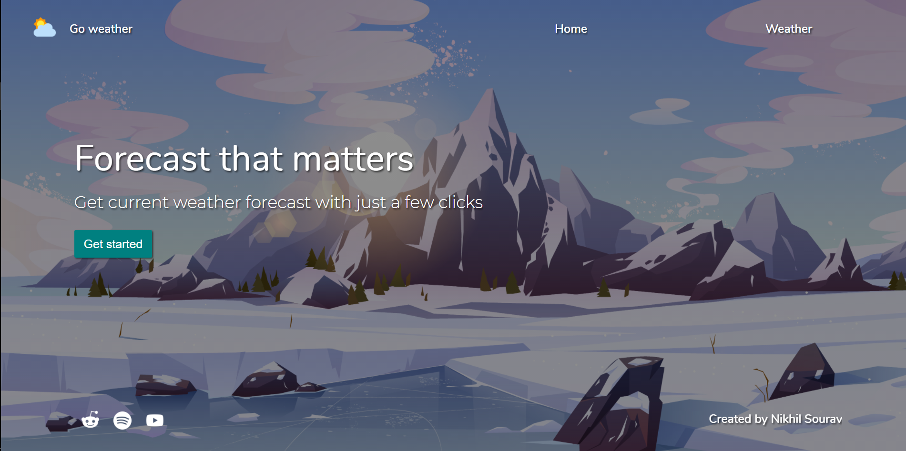
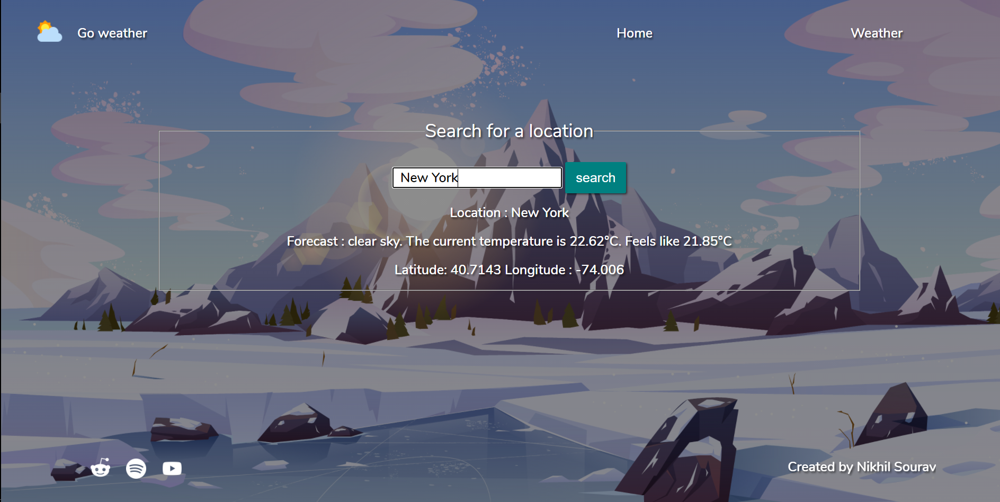

# Go Weather

[Go Weather](http://weather-app-by-ns.herokuapp.com/) is an app that utilizes data provided by [openweathermap.org](openweathermap.org) to display weather of a location searched by user.

## Demo:

- Landing page:

    

- Details page:

    

## About this app:

Tech used:

- [nodejs](https://nodejs.org/en/)
- [expressjs](https://expressjs.com/)
- [handlebars](https://handlebarsjs.com/)

Features:

- Accurate current temperature.
- Daily Forecast.
- Latitude and Longitude of entered location.
